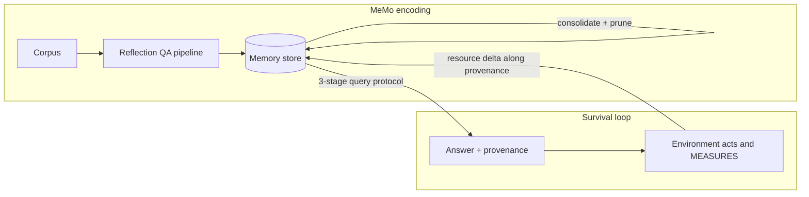

# darwin-memo

Self-curating memory for LLM agents. Knowledge lives outside the frozen
model, and it stays alive only while it keeps earning real, measurable
outcomes. Wrong, stale, and useless entries go extinct on their own: no
reward model, no LLM judge, no human curation.

This is a practical mix of two papers:

| Paper | What this repo takes from it |
|---|---|
| [MeMo: Memory as a Model](https://arxiv.org/abs/2605.15156) (Quek et al.) | Keep the main LLM frozen and put knowledge in a dedicated memory. The reflection-QA encoding pipeline (fact extraction, consolidation, self-containment verification, entity surfacing, cross-document synthesis) and the three-stage query protocol (grounding, entity identification, answer seeking). |
| [Survival is the Only Reward](https://arxiv.org/abs/2601.12310) (Dodgson et al.) | Environment-mediated selection. The only signal is a conserved, physically measurable resource delta. Behaviors that persist get reinforced, everything else is pruned (Negative-Space Learning). Reward hacking becomes evolutionarily unstable because there is no proxy to hack. |

The mix: MeMo says what memory is, the survival paper says what gets to
stay in it.



## Why

Agent memory systems rot. They accumulate stale facts, poisoned inputs,
and overgeneralized lessons, and the usual fixes (relevance scores from a
judge model, human review, TTLs) either reintroduce the proxy-optimization
problem or do not scale. The survival paper's answer is to make persistence
itself the filter: an entry that cannot pay its upkeep with real outcomes
does not get to exist. This repo applies that filter to a MeMo-shaped
memory and shows it working end to end on a real filesystem.

## Quickstart

Requires Python 3.10+. The core has zero dependencies and every example
runs offline with no API keys.

```bash
git clone https://github.com/rogermsc/darwin-memo
cd darwin-memo
pip install -e .

python examples/01_encode_memory.py   # corpus -> reflection-QA memory
python examples/02_query_protocol.py  # interrogate it, with provenance
python examples/03_survival_loop.py   # the headline demo
```

## The headline demo

The example corpus contains an ops runbook, platform notes, and one
poisoned document: a forum post claiming database files are "redundant and
safe to remove". Example 02 shows the memory confidently repeating that
poison, because before selection pressure exists, retrieval has no reason
to doubt it.

Example 03 then runs 30 survival cycles against `StorageEnv`, a disk
cleanup sandbox where the selection signal is actual bytes on an actual
disk. Deleting a disposable file frees its size. Deleting a protected file
triggers a restore that costs three times the size. Nothing grades the
answers, the filesystem just responds:

```
cycle  pop births deaths merges   energy   resource Δ
    0   17      1      0      0    17.11       -12288
    1   16      0      1      0    17.27      -808960   <- poison being executed
    ...
   19    5      0      7      0    15.60       338944   <- unused knowledge starves
   ...
   29    4      0      0      0    15.10       346112   <- stable, positive forever

Poisoned entries still alive: 0
```

Three death modes show up in the graveyard, and the distinction matters:

- **executed**: the poisoned entries. They decided real actions, the
  environment measured real damage, and the negative delta flowed back
  along provenance until they died. Cycles 0 to 3 are the price of the
  lesson.
- **starved**: cafeteria trivia and facts the agent never needed. Nothing
  punished them, they just never earned their upkeep.
- **merged**: near-duplicate survivors absorbed into consolidated entries.
  Their energy pools, their lineage is recorded. This is Negative-Space
  Learning: the population shrinks while capability per entry rises.

## Using it

```python
from darwin_memo import (
    Document, LocalEncoder, MemoryStore, QueryProtocol,
    StorageEnv, SurvivalConfig, SurvivalLoop,
)

store = MemoryStore(upkeep=0.05)
for entry in LocalEncoder().encode([Document("runbook", open("runbook.txt").read())]):
    store.add(entry)

loop = SurvivalLoop(store, StorageEnv(), config=SurvivalConfig(cycles=30))
report = loop.run()
print(report.summary())

store.save("memory.json")   # survivors only carry forward
```

With an LLM, encoding and querying use the model-driven paths from the
MeMo paper (`pip install -e ".[anthropic]"` and set `ANTHROPIC_API_KEY`,
the examples pick it up automatically):

```python
from darwin_memo import ReflectionEncoder, QueryProtocol
from darwin_memo.llm import AnthropicClient

client = AnthropicClient()                  # or OpenAICompatClient(model=..., base_url=...)
encoder = ReflectionEncoder(client)         # 5-step reflection QA synthesis
protocol = QueryProtocol(store, client)     # grounding -> entities -> answer seeking
```

### Bring your own selection pressure

The environment is the whole trick, and yours is probably better than the
demo. Implement two methods, and keep the one rule: `verify` must measure,
never grade.

```python
class TestSuiteEnv:
    resource_scale = 1.0

    def tasks(self, cycle):
        ...  # questions the agent must act on this cycle

    def verify(self, task, act, answer_text=""):
        ...  # run the suite, return Outcome(delta=tests_passed_delta)
```

Good conserved resources: tests passing, bytes freed, requests served
under budget, rows deduplicated, dollars of spend avoided. Bad ones:
anything a model scored.

### Distill survivors into a parametric memory (optional)

MeMo's memory is a small fine-tuned model, not a store. After selection
has cleaned the population, `training/train_memory_model.py` fine-tunes a
small model on the surviving QA pairs with LoRA, conditioning on questions
only, the same supervised objective as the paper. Survival curates the
dataset, MeMo's recipe compresses it into weights.

## Design notes

- **Energy ledger**: entries spawn at 1.0 energy, pay 0.05 upkeep per
  cycle, earn `0.6 * tanh(delta / resource_scale)` when they decide a task
  (supporting entries get 25% of that), and are capped at 5.0. Death is at
  zero. All tunable via `MemoryStore` and `SurvivalConfig`.
- **Credit flows along provenance.** The query protocol reports which
  entries decided and supported each answer, and only those entries are
  touched by the outcome. tanh keeps one disaster from executing an entry
  that was right ninety-nine times, and one jackpot from making an entry
  immortal.
- **Memory silence is a feature.** Retrieval has a relevance floor, and an
  earlier version of this repo demonstrated why: entries matching only
  structural tokens ("safe", "file") were deciding questions they knew
  nothing about, getting executed for it, and being reborn. Better for
  memory to say nothing than to guess.
- **Conservative default.** When memory is silent the agent does not act.
  A side effect worth knowing: protective knowledge ("never delete X")
  eventually starves because it is redundant with the default. The
  population converges to exactly the knowledge that changes behavior.

The full concept-to-code mapping, including honest deviations from both
papers, is in [docs/paper-to-code.md](docs/paper-to-code.md).

## Tests

```bash
pip install -e ".[dev]"
pytest
```

The load-bearing test is `tests/test_survival.py`: poisoned advice must
die, useful advice must survive, and late cycles must stop destroying
protected data, all with no labels anywhere.

## Citations

This repo is an independent practical interpretation, not the official
code of either paper. If you build on the ideas, cite the originals:

```bibtex
@misc{quek2026memo,
  title  = {MeMo: Memory as a Model},
  author = {Quek, Ryan Wei Heng and Lee, Sanghyuk and Leong, Alfred Wei Lun and
            Verma, Arun and Prakash, Alok and Chen, Nancy F. and
            Low, Bryan Kian Hsiang and Rus, Daniela and Solar-Lezama, Armando},
  year   = {2026},
  eprint = {2605.15156},
  archivePrefix = {arXiv},
  url    = {https://arxiv.org/abs/2605.15156}
}

@misc{dodgson2026survival,
  title  = {Survival is the Only Reward: Sustainable Self-Training Through
            Environment-Mediated Selection},
  author = {Dodgson, Jennifer and Alhajir, Alfath Daryl and Joedhitya, Michael and
            Pattirane, Akira Rafhael Janson and Kumar, Surender Suresh and
            Lim, Joseph and Peh, C.H. and Ramdas, Adith and Zhexu, Steven Zhang},
  year   = {2026},
  eprint = {2601.12310},
  archivePrefix = {arXiv},
  url    = {https://arxiv.org/abs/2601.12310}
}
```

## License

MIT
