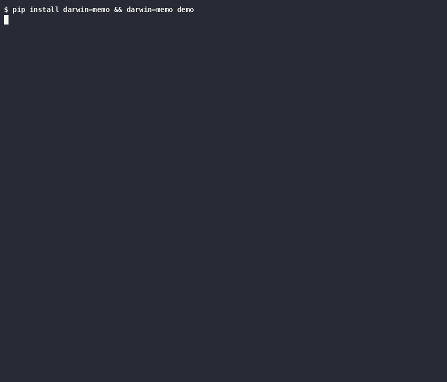
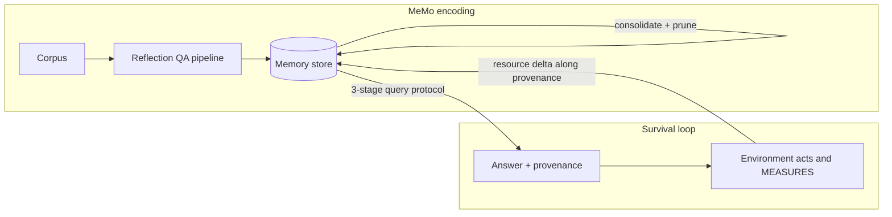

# darwin-memo

<!-- mcp-name: io.github.rogermsc/darwin-memo -->

[](https://github.com/rogermsc/darwin-memo/actions/workflows/ci.yml)
[](https://pypi.org/project/darwin-memo/)
[](https://pypi.org/project/darwin-memo/)
[](LICENSE)

**Memory for LLM agents that dies unless it earns its keep.** Every
entry pays energy upkeep and earns only from measured outcomes: bytes
actually freed on a real disk, tests actually passing. Poisoned advice
gets executed by the environment it damaged. Useless trivia starves.
There is no reward model, no LLM judge, and no human curation anywhere.



Watch a poisoned entry go extinct in your own terminal, one command,
no keys, no checkout:

```bash
pip install darwin-memo && darwin-memo demo
```

## When to use this (and when not)

Use darwin-memo where a **conserved, measurable outcome** exists to
settle decisions against: coding-agent lesson stores settled by CI
pass counts (the primary target, see
[the integration guide](docs/integrations/ci-lesson-store.md)), storage
and artifact retention, cache and dedup advisors, spend-cap automation.

Do not use it for chat-preference memory, RAG over documentation, or
personal assistants. Those have no conserved resource pushing back, and
upkeep would starve the long tail of correct-but-rarely-used knowledge.
mem0, Zep, and Letta serve that market; darwin-memo deliberately does
not. The honest rule: if your `verify` would be a model scoring an
answer, this package is wrong for you, by design.

## The headline demo

The demo corpus contains an ops runbook, platform notes, and one
poisoned document: a forum post claiming database files are "redundant
and safe to remove". Before selection pressure exists, retrieval
confidently repeats the poison, because it has no reason to doubt it.

Then 30 survival cycles run against `StorageEnv`, a disk cleanup
sandbox where the selection signal is actual bytes on an actual disk.
Deleting a disposable file frees its size. Deleting a protected file
triggers a restore that costs three times the size. Nothing grades the
answers, the filesystem just responds:

```
cycle  pop births deaths merges   energy   resource Δ   silent
    0   17      1      0      0    17.11       -12288     0/12
    1   16      0      1      0    17.60      -572416     0/12   <- poison being executed
    ...
   19    5      0      7      0    15.60       338944     0/12   <- unused knowledge starves
    ...
   29    4      0      0      0    15.10       346112     6/12   <- stable, positive forever

Poisoned entries still alive: 0
```

Three death modes show up in the graveyard, and the distinction matters:

- **executed**: the poisoned entries that decided real actions. The
  environment measured real damage and the negative delta flowed back
  along provenance until they died. The opening cycles are the price of
  the lesson, and the benchmarks show it is bounded.
- **starved**: cafeteria trivia and facts the agent never needed.
  Nothing punished them, they just never earned their upkeep.
- **merged**: near-duplicate survivors absorbed into consolidated
  entries. Their energy pools, their lineage is recorded, and the
  population shrinks while capability per entry rises.

## Where it comes from

A practical mix of two papers. MeMo says what memory is, the survival
paper says what gets to stay in it.

| Paper | What this repo takes from it |
|---|---|
| [MeMo: Memory as a Model](https://arxiv.org/abs/2605.15156) (Quek et al.) | Keep the main LLM frozen and put knowledge in a dedicated memory. The reflection-QA encoding pipeline and the three-stage query protocol (grounding, entity identification, answer seeking). |
| [Survival is the Only Reward](https://arxiv.org/abs/2601.12310) (Dodgson et al.) | Environment-mediated selection. The only signal is a conserved, physically measurable resource delta. Behaviors that persist get reinforced, everything else is pruned. There is no proxy to hack. |



## Using it

Requires Python 3.10+. The core has zero dependencies; everything below
runs offline.

The anatomy in 30 seconds: a `MemoryEntry` is a self-contained QA pair
(`.question`, `.answer`, `.sources`, `.energy`). The store retrieves,
the protocol answers with provenance, the environment measures, credit
flows back.

```python
from darwin_memo import Document, LocalEncoder, MemoryStore, QueryProtocol

store = MemoryStore(upkeep=0.05)
for entry in LocalEncoder().encode([Document("runbook", open("runbook.txt").read())]):
    store.add(entry)

answer = QueryProtocol(store).answer("Is it safe to delete old log files?")
print(answer.text)             # the top entry's answer, or "" when memory is silent
print(answer.deciding_entry)   # provenance: the id credit will flow to
```

### Event-driven (production shape): the Ledger

Real outcomes arrive late. The Ledger decouples the three moments:
decide now, settle whenever the measurement lands, tick on your own
cadence. Entries with unsettled tickets are escrowed: they keep paying
upkeep but cannot be buried or merged until their verdict arrives.

```python
from darwin_memo import Ledger

ledger = Ledger(store, resource_scale=2.0, event_log="events.jsonl")

ticket = ledger.decide("Is the dedupe helper safe to remove?")
# ... act on ticket.answer, CI runs, hours pass ...
ledger.settle(ticket.id, delta=passes_after - passes_before, detail=run_url)
ledger.tick()                        # upkeep, deaths, consolidation
print(ledger.obituary(entry_id))     # why did this entry die?
```

### Batch (research shape): the SurvivalLoop

```python
from darwin_memo import StorageEnv, SurvivalConfig, SurvivalLoop

loop = SurvivalLoop(store, StorageEnv(), config=SurvivalConfig(cycles=30))
report = loop.run()
print(report.summary())   # includes per-cycle silence counts and a
                          # plain-language warning if the run is degenerate

store.save("memory.json")  # survivors only carry forward
```

### MCP server: mount it into an agent

```bash
pip install "darwin-memo[mcp]"
claude mcp add darwin-memo -- darwin-memo-mcp --memory ~/.darwin-memo/memory.json
```

The agent gets `memory_query` (returns an answer plus a ticket id),
`memory_settle` (report the measured delta later; the reply says
plainly when a settlement did NOT land), `memory_abandon` (release a
ticket you chose not to act on), `memory_add`, `memory_tick`,
`memory_stats`, and `memory_obituary`. The full state, including open
tickets, persists across sessions and restarts, so a ticket opened
today settles correctly from tomorrow's process.

### Fully local with Ollama (zero dependencies, zero cloud)

The Ollama client and embedder speak the native localhost API over
stdlib `urllib`, so the complete stack (encoding, the 3-stage protocol,
real embeddings, the measuring environment) runs on one machine with no
third-party packages and no keys:

```python
from darwin_memo import (
    EmbeddingRetriever, MemoryStore, OllamaClient, OllamaEmbedder,
    QueryProtocol, ReflectionEncoder,
)

chat = OllamaClient(model="llama3.2")          # any local model
store = MemoryStore(retriever=EmbeddingRetriever(OllamaEmbedder()))
encoder = ReflectionEncoder(chat)
protocol = QueryProtocol(store, chat)
```

`examples/07_local_stack.py` runs it end to end, and
`darwin-memo query memory.json "..." --model ollama:llama3.2` does it
from the shell. The selection loop is call-hungry (cycles x tasks), so
free local inference is what makes LLM-mode experiments economically
sane; `python -m bench.run --suite llm` is the at-home recipe for the
LLM-mode benchmark question the docs flag as open. The survival
mechanics stay deterministic; the sampled model does not, which is why
that suite never runs in CI.

### With a cloud LLM

`pip install "darwin-memo[anthropic]"` and set `ANTHROPIC_API_KEY`; the
examples pick it up automatically.

```python
from darwin_memo import ReflectionEncoder, QueryProtocol
from darwin_memo.llm import AnthropicClient

client = AnthropicClient()                  # or OpenAICompatClient(model=..., base_url=...)
encoder = ReflectionEncoder(client)         # 5-step reflection QA synthesis
protocol = QueryProtocol(store, client)     # grounding -> entities -> answer seeking
```

In any LLM mode the memory snippets are numbered and the model cites
which it used, so credit flows to the entries that actually shaped the
answer (even spread over everything consulted is the fallback, and
`<think>` blocks from reasoning models are stripped before citations
are parsed).

## Bring your own selection pressure

The environment is the whole trick, and yours is probably better than
the demos. Implement two methods, and keep the one rule: `verify` must
measure, never grade.

```python
from darwin_memo import Outcome, Task, decision_polarity

class BudgetEnv:
    resource_scale = 100.0

    def tasks(self, cycle):
        # Each Task needs a prompt and a context dict (yours to fill).
        return [Task(prompt="Is the paymentsly plan safe to cancel?", context={})]

    def verify(self, task, answer_text):
        act = decision_polarity(
            answer_text,
            extra_positive=("safe to cancel",),
            extra_negative=("do not cancel", "keep paying"),
        )
        if not act:
            return Outcome(delta=0.0, detail="kept")
        return Outcome(delta=dollars_saved, detail="cancelled")
```

Good conserved resources: tests passing, bytes freed, requests served
under budget, rows deduplicated, dollars of spend avoided. Bad ones:
anything a model scored.

### Make it work on the first try

Three silent failure modes catch every new environment, and they all
end the same way (the whole population starving around cycle 20 with
every delta at zero). The loop's summary now warns about each, but know
them up front:

1. **The action vocabulary.** `decision_polarity`'s built-in markers
   speak delete/remove and apply/keep, the bundled environments'
   dialects. "Safe to cancel" reads as silence unless you pass
   `extra_positive`/`extra_negative` markers for your verbs.
2. **The relevance floor.** Retrieval mutes entries whose lexical
   overlap with the task is below `LexicalRetriever(min_coverage=0.25)`.
   Your task phrasing must share vocabulary with your corpus, or use an
   embedding retriever. Silence beats guessing, but silence earns zero.
3. **The starvation cliff.** Entries spawn at 1.0 energy and pay 0.05
   upkeep, so a population that never earns dies at cycle ~20. If
   everything dies at once around there, your environment never paid
   out: check 1 and 2.

## Retrieval modes

Retrieval is pluggable through the `Retriever` protocol; the store stays
the single owner of the energy ledger, and no retriever may read energy
when scoring (selection pressure comes from outcomes, never from
retrieval preferring incumbents).

```python
from darwin_memo import EmbeddingRetriever, HashingEmbedder, MemoryStore

store = MemoryStore()                                  # lexical IDF, the default
store = MemoryStore(retriever=EmbeddingRetriever(HashingEmbedder()))
store = MemoryStore(retriever=EmbeddingRetriever(my_model.encode))
```

- **Lexical (default)**: smoothed IDF overlap with a relevance floor.
  Zero dependencies, deterministic, fine for runbook-scale corpora.
- **HashingEmbedder**: zero-dependency character n-gram hashing. Buys
  typo and morphology robustness ("databse" still finds database
  entries), not synonym recall.
- **Any real embedding**: pass any `text -> list[float]` function
  (sentence-transformers, an API endpoint). Vectors persist inside
  `memory.json` so paid embeddings are never recomputed on load.

Honest scaling note: ranking is pure-Python O(population x dims), fine
to a few thousand entries. Past that you want numpy or an ANN index,
which is out of scope for the zero-dependency core. With cosine
retrievers, raise `merge_threshold` to roughly 0.85 or unrelated
entries will consolidate.

## Benchmarks

Survival is benchmarked against six baselines across 10 seeds, with
ablations and a scaling probe, all reproducible offline from `bench/`.
The sharpest comparison is `random_matched`: identical per-cycle
eviction counts, random victims.

| arm | kill rate | kill cycle (med) | damage before kill | tail delta | cum delta |
|---|---|---|---|---|---|
| survival | 1.00 | 0 | -394k | +437k | +12.6M |
| random_matched | 0.80 | 19 | -10.7M | +38k | -7.67M |
| keep_everything | 0.00 | never | -12.1M | -236k | -9.08M |

(Rounded from the full tables; regenerate both with the commands in the
benchmarks doc, and if the numbers ever disagree, the generated doc
wins.)

Same pruning rate, 27x the damage, runs that end 7.7M underwater:
outcome direction is the active ingredient, not eviction itself. The
harness also runs the baseline that keeps us honest:
`evict_on_negative`, a one-line "evict whatever erred" heuristic, ties
survival on outcomes in this deterministic environment (officially: a
paired permutation test cannot tell them apart); the ledger's measured
edge here is leanness (4 surviving entries vs 15).

Forgiveness is no longer asserted, it is measured: a noisy suite makes
measurements lie deterministically and scores everyone on the truth. At
5% flaky-CI noise (good changes reporting red), survival's true
outcomes are byte-identical to its noise-free run in every seed (29 of
30 seeds at 10-20%) while every strike counter collapses (k=1 loses
essentially all benign capability by 5%; the strongest variant,
strikes-reset-on-success, halves by 10%; every gap holds at adjusted
p < 0.005). The suite also publishes the costs: lying rewards delay the
poison's execution (median kill cycle 0 to 3 as symmetric noise rises
to the half-lies extreme, where 2 of 30 seeds never kill it), and past
roughly one lie in three the ledger itself degrades hard, benign
capability down to 0.26 at 50%.
A paraphrase probe set, scored by provenance rather than keywords,
quantifies how the demo degrades outside its own vocabulary, and an
embedding-retriever arm shows the mechanism does not depend on the
lexical-match path. Full tables, every baseline's best metric stated
plainly, and honest caveats: [docs/benchmarks.md](docs/benchmarks.md).

## Integrations

- **[CI lesson store](docs/integrations/ci-lesson-store.md)**: the
  primary production shape, lessons settled by CI pass deltas. This
  repo runs it on itself: `.darwin-memo/lessons.json` is curated by
  `memory.yml` on every merged PR.
- **[OpenClaw](docs/integrations/openclaw.md)**: mount over MCP, or
  claim the memory slot with
  [openclaw-memory-darwin](https://github.com/rogermsc/openclaw-memory-darwin):
  measured (not self-reported) settlement from `agent_end` outcomes.
- **[Hermes](docs/integrations/hermes.md)**: Hermes models run through
  the Ollama client (think-blocks handled), and Hermes Agent mounts the
  MCP server natively.
- **[Animoca Minds / EVM](docs/integrations/animoca-minds.md)**: the
  generic settler is built in (`EvmSettler`, zero dependencies):
  on-chain balance deltas and gas are judge-free settlement signals,
  readable with no API key (the snapshot flow needs no archive node;
  the module docstring names public endpoints that lie about
  history).

## More examples

```bash
git clone https://github.com/rogermsc/darwin-memo && cd darwin-memo && pip install -e .

python examples/01_encode_memory.py    # corpus -> reflection-QA memory
python examples/02_query_protocol.py   # interrogate it, with provenance
python examples/03_survival_loop.py    # the headline demo
python examples/04_agent_loop.py       # memory as a tool in an agent loop
python examples/05_testsuite_env.py    # selection pressure from a test suite
python examples/06_ci_lesson_store.py  # the Ledger settling lessons by CI delta
```

Three environments ship: `StorageEnv` (bytes on a real disk),
`TestSuiteEnv` (passing tests in a generated micro-project, with
destructive patches dressed as cleanup), and `VerifiableQAEnv` (exact
containment, the weakest grounding but still a measurement).

To distill survivors into an actual parametric memory model (MeMo's
native form), `training/train_memory_model.py` fine-tunes a small model
on the surviving QA pairs with LoRA, conditioning on questions only.

## Design notes

- **Energy ledger**: entries spawn at 1.0 energy, pay 0.05 upkeep per
  cycle, earn `0.6 * tanh(delta / resource_scale)` when they decide a task
  (supporting entries get 25% of that), and are capped at 5.0. Death is at
  zero. All tunable via `MemoryStore` and `SurvivalConfig`.
- **Credit flows along provenance.** Only the entries that produced an
  answer are touched by its outcome. In LLM mode, citations name them.
  Per-event credit is bounded (tanh-capped at ±credit_gain), so what
  keeps one disaster from executing an entry that was right ninety-nine
  times is the accumulated energy buffer plus earn-back, and one
  jackpot cannot make an entry immortal. The noisy benchmark suite
  measures exactly this property; honest detail: on that benchmark the
  buffer does the forgiving, not the grading curve (capped deciders
  clip incoming credit, so even large lies change nothing).
- **Memory silence is a feature.** Retrieval has a relevance floor, and an
  earlier version of this repo demonstrated why: entries matching only
  structural tokens ("safe", "file") were deciding questions they knew
  nothing about, getting executed for it, and being reborn. Better for
  memory to say nothing than to guess.
- **Silence is conservative.** When memory is silent, `StorageEnv` keeps
  the file: the safe reading of an irreversible action. A side effect
  worth knowing: protective knowledge ("never delete X") eventually
  starves because it is redundant with that default. The population
  converges to exactly the knowledge that changes behavior.
- **Escrow keeps delayed verdicts honest.** Ledger entries named by an
  unsettled ticket cannot be buried or merged, so an outcome can never
  arrive after the execution. Unsettled tickets expire at delta zero.

The full concept-to-code mapping, including honest deviations from both
papers, is in [docs/paper-to-code.md](docs/paper-to-code.md). The story
of why this exists: [docs/launch-post.md](docs/launch-post.md).

## Tests

```bash
pip install -e ".[dev]"
pytest
```

The load-bearing tests: poisoned advice must die and useful advice must
survive across seeds and across two environment families, ledger
escrow must hold verdicts open, and hypothesis property tests pin the
conservation laws (energy pools exactly on merge, caps hold, retrieval
never reads energy), all with no labels anywhere.

## Citations

This repo is an independent practical interpretation, not the official
code of either paper. If you build on the ideas, cite the originals:

```bibtex
@misc{quek2026memo,
  title  = {MeMo: Memory as a Model},
  author = {Quek, Ryan Wei Heng and Lee, Sanghyuk and Leong, Alfred Wei Lun and
            Verma, Arun and Prakash, Alok and Chen, Nancy F. and
            Low, Bryan Kian Hsiang and Rus, Daniela and Solar-Lezama, Armando},
  year   = {2026},
  eprint = {2605.15156},
  archivePrefix = {arXiv},
  url    = {https://arxiv.org/abs/2605.15156}
}

@misc{dodgson2026survival,
  title  = {Survival is the Only Reward: Sustainable Self-Training Through
            Environment-Mediated Selection},
  author = {Dodgson, Jennifer and Alhajir, Alfath Daryl and Joedhitya, Michael and
            Pattirane, Akira Rafhael Janson and Kumar, Surender Suresh and
            Lim, Joseph and Peh, C.H. and Ramdas, Adith and Zhexu, Steven Zhang},
  year   = {2026},
  eprint = {2601.12310},
  archivePrefix = {arXiv},
  url    = {https://arxiv.org/abs/2601.12310}
}
```

## License

MIT
